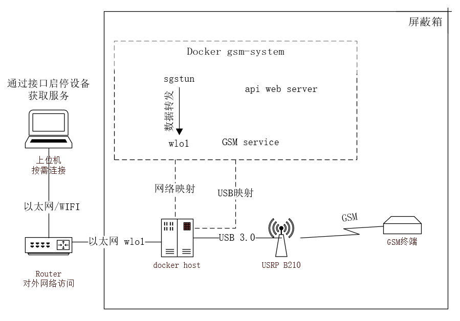

## GSM-System

GSM-System是一款搭建GSM基站环境的工具，目前公开的相关工具通常安装配置较为复杂，可以直接获取的信息较少，使用前需要花费大量时间去学习相关基础知识，使用该系统可以快速运行起一个可用的GSM网络环境，并具备以下特性：

+ 快速搭建与启动，只需要运行启动docker容器即可使用，对操作者技能要求较低；
+ 能够直接通过相关接口便能获取到终端设备信息，和监控当前系统中的短信信息
+ 直接快速切换不同基站配置，适应不同要求
+ 设备简单，USRP即可

### 系统架构

### 系统功能

​	docker环境启动之后，该套件通过API提供服务，提供多种功能

| 功能           | 说明                                                         |
| -------------- | ------------------------------------------------------------ |
| 预设参数配置   | 可以使用预设参数对系统进行配置，包含band900、band1800等多个预设配置 |
| 配置读取       | 针对GSM的每一个参数对系统进行配置，如ARFCNs、C0、mcc、mnc等参数 |
| 自定义参数配置 | 通过该功能可获取到系统的所有配置参数，监控设备运行状态       |
| 数据转发       | 使用该功能，可开启系统内部数据转发功能，允许附着在该系统的设备访问外部网络 |
| 终端号码设置   | 可对附着在该系统上的终端设备自定义设置电话号码               |
| 终端信息读取   | 可获取附着在该系统上的终端设备的信息，如IMSI、IMEI、IP等     |
| SMS短信读取    | 可通过该功能监控和查阅系统中的短信数据、包含发送者、接收者、短信内容等信息 |
| 终端间通话     | 可实现附着在系统上的各终端间使用配置的电话号码进行通话       |
| SMS短信发送    | 可直接向附着在该系统上的指定终端设备发送短信                 |
| 终端间短信发送 | 可实现附着在系统上的各终端之间通过配置的电话号码进行短信收发 |

