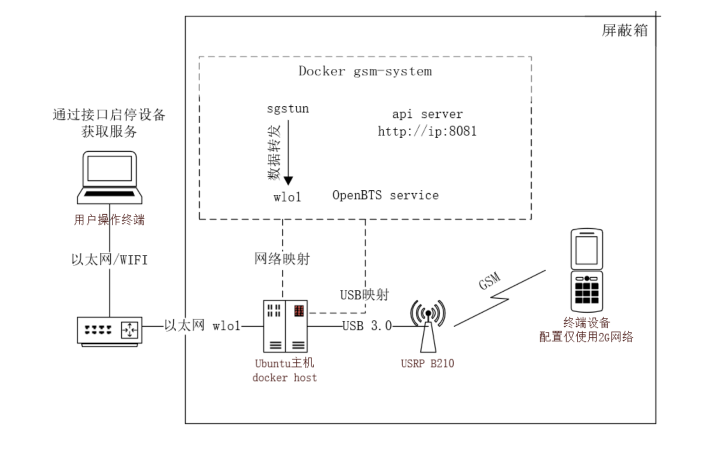

## GSMSYSTEM部署与使用

### 研发目的

该GSM-system可以帮助研究成员快速搭建起一个可用的GSM网络环境。

目前公开的相关操作系统通常安装配置较为复杂，可以直接获取的信息较少，使用前需要花费大量时间去学习相关基础知识。

使用该系统可以直接通过dockers运行起一个可用的GSM网络环境，并实现以下功能：

+ 快速搭建与启动，只需要运行启动docker容器即可使用，对操作者技能要求较低；

+ 能够直接通过相关接口便能获取到终端设备信息，和监控当前系统中的短信信息

+ 直接快速切换配置，适应不同要求

  -------

  | 功能项      | 类型     | 备注             |
  | ----------- | -------- | ---------------- |
  | GSM系统模拟 | 攻击测试 |                  |
  | IMSI抓取    | 数据操作 |                  |
  | 流量分析    | 数据操作 | 需要手动抓包分析 |
  | 短信监控    | 数据操作 | 无法获取中文内容 |
  | 电话拨打    | 数据操作 | 两台设备互相拨打 |

  

### 版本更新记录

+ V1.0 初代版本，实现基础功能。

### 一. 运行环境&设备要求

* 操作系统 : 物理机运行Ubuntu20.04及以上;

* 软件环境 : docker;

* 硬件设备 : USRP B210

* 系统架构

  

### 二. docker镜像部署

完整运行以打包为docker进行，服务开机自启，无需对docker镜像镜像其他操作

* docker镜像已推送至实验室服务器，可以在NERV下直接拉取

```bash
docker pull registry.jiahao.li/addx/gsmsystem:1.1
```

* 容器启动命令

```bash
docker run -dti --privileged --net=host -v /dev/bus/usb:/dev/bus/usb --name=srslte gsmsystem:1.0
```

宿主机USB整体映射到容器之中，已连接USRP B210这一USB设备;

需要与物理机共享网络,这里需要知道物理机的出口网卡,供后续启动系统使用.

### 三. 使用说明

docker环境启动之后，该套件通过API提供服务，目前提供了8个API,均使用POST请求发送,传参和接受参数均使用json格式的数据

```
ipaddress:8081/start # 启动2G系统
ipaddress:8081/stop # 停止2G系统
ipaddress:8081/config # 对整套系统进行基础配置
ipaddress:8081/getconfig # 获取当前的所有配置信息
ipaddress:8081/allconfig # 单独对每一项配置进行修改
ipaddress:8081/iptables # 配置系统网络数据转发
ipaddress:8081/smsinfo # 获取当前系统中短信相关信息
ipaddress:8081/ueinfo # 获取当前系统中所有终端设备信息
ipaddressL8081/setphonenumber # 配置已连接到设备的电话号码
```

#### 1. start

##### Request

​	无需传入参数

##### Response

``` json
{"status": true, "message_id": 1, "message": "Start successfully"}
```

+ status : 执行结果, 启动成功为true,其他为false

+ message_id : 响应结果id

+ message : 响应信息

+ message_id与message对应关系

  | message_id | message                                              | 备注                            |
  | ---------- | ---------------------------------------------------- | ------------------------------- |
  | 0          | start failed                                         | 未知启动失败,需要查阅日志.      |
  | 1          | start success                                        | 启动成功.                       |
  | 2          | is running                                           | 设备正在运行中.                 |
  | 3          | device is not connected, please connect usrp device. | 未连接USRP，请接入设备后在尝试. |

##### 注意事项

+ 启动设备需要一定时间,可能会时间很长，需要等待，如果出现超时，请先请求stop api再重新使用start api启动;

#### 2. stop

##### Request

​	无需传入参数

##### Response

``` json
{"status": true, "message_id": 1, "message": "stop successfully"}
```

+ status : 执行结果, 启动成功为true,其他为false

+ message_id : 响应结果id

+ message : 响应信息

+ message_id与message对应关系

  | message_id | message      | 备注                      |
  | ---------- | ------------ | ------------------------- |
  | 0          | stop failed  | 关闭设备失败,需要查阅日志 |
  | 1          | stop success | 关闭设备成功              |
  | 2          | not running  | 程序未在运行在,无需关闭   |

##### 注意事项

+ 暂无

#### 3. config

##### Request

``` json
{"id":0}
```

+ id: 预设配置的id，详见下表

  | id   | 备注                                                         |
  | ---- | ------------------------------------------------------------ |
  | 0    | ARFCNs: 1, C0: 540, band: 1800, short name: test, mcc: 001, mnc: 01 |
  | 1    | ARFCNs: 1, C0: 55, band: 900, mcc: 460, mnc: 00, LAC: 4420, CI:41240, short name: ChinaMobile |
  | 2    | ARFCNs: 1, C0: 540, band: 1800, mcc: 460, mnc: 00, LAC: 46980, CI:41286, short name: ChinaMobile |
  | 3    | ARFCNs: 1, C0: 70, band: 900, mcc: 460, mnc: 01, LAC: 4420, CI:41240, short name: ChinaUnicom |
  | 4    | ARFCNs: 1, C0: 668, band: 1800, mcc: 460, mnc: 01, LAC: 46980, CI:41286, short name: ChinaUnicom |

+ 备注：后续会继续调试配置，暂时只能使用测试配置

##### Response

``` json
{"status": true, "message_id": 1, "message": "Success, please start system manually."}
```

+ status : 执行结果, 启动成功为true,其他为false

+ message_id : 响应结果id

+ message : 响应信息

+ message_id与message对应关系

  | message_id | message                                | 备注                                                  |
  | ---------- | -------------------------------------- | ----------------------------------------------------- |
  | 0          | Failed                                 | 未知失败,需要查阅日志。                               |
  | 1          | Success, please start system manually. | 修改配置成功，请手动启动系统。                        |
  | 2          | Stop failed，please stop manually.     | 关闭系统失败，需要手动请求stop api关闭                |
  | 3          | Can not find database file.            | 无法找到数据库文件，请检查/etc/OpenBTS/OpenBTS.db文件 |

+ 备注：修改配置文件之前需要关闭系统，所以可能会出现message_id = 2的情况。

#### 4. getconfig

##### Request

​	无需传入参数

##### Response

```json
{
    "status": true,
    "message_id": 1,
    "message": "Success",
    "data": [
        [
            "CLI.Interface",
            "127.0.0.1"
        ],
	......
        [
            "Log.Level",
            "INFO"
        ]
    ]
}
```

+ status : 执行结果, 启动成功为true,其他为false

+ message_id : 响应结果id

+ message : 响应信息

+ message_id与message对应关系

  | message_id | message                     | 备注                                                  |
  | ---------- | --------------------------- | ----------------------------------------------------- |
  | 0          | Failed                      | 未知失败,需要查阅日志。                               |
  | 1          | Success                     | 读取配置成功请手动启动系统。                          |
  | 2          | Can not find database file. | 无法找到数据库文件，请检查/etc/OpenBTS/OpenBTS.db文件 |

+ data：

  ```
  [
  	配置名称，
  	配置参数
  ]
  ```

+ 备注：此处配置文件较多

#### 5. allconfig

##### Request

```json
{
    "name":"GSM.Identity.ShortName",
    "value":"gsmsystem"
}
```

+ name: 配置名称；
+ value：配置参数
+ 备注：使用此api修改配置后，需要手动重启，可以先多次以不同参数请求该api修改多项参数后，再重启

##### Response

```json
{"status": true, "message_id": 1, "message": "Success"}
```

+ status : 执行结果, 启动成功为true,其他为false

+ message_id : 响应结果id

+ message : 响应信息

+ message_id与message对应关系

  | message_id | message                     | 备注                                                  |
  | ---------- | --------------------------- | ----------------------------------------------------- |
  | 0          | Failed                      | 未知失败,需要查阅日志。                               |
  | 1          | Success                     | 修改配置成功，请重启系统。                            |
  | 2          | Can not find database file. | 无法找到数据库文件，请检查/etc/OpenBTS/OpenBTS.db文件 |

#### 6. iptables

##### Request

```json
{"iface":"wlo1"}
```

+ ifce: 出口网络接口名称，如:

  

##### Response

```json
{"status": true, "message_id": 1, "message": "Success"}
```

+ status : 执行结果, 启动成功为true,其他为false

+ message_id : 响应结果id

+ message : 响应信息

+ message_id与message对应关系

  | message_id | message | 备注              |
  | ---------- | ------- | ----------------- |
  | 0          | Failed  | 失败,请查阅日志。 |
  | 1          | Success | 执行成功。        |

##### 注意事项

​	此项配置只需要再docker启动后执行一次即可，如需更换出口网络接口可再次执行。

#### 7. smsinfo

##### Request

+ 无需传入参数

##### Response

```json
{
    "status": true,
    "message_id": 1,
    "message": "Success",
    "infos": [
        [
            "2021-08-13T17:31:06.2",
            "Hhh",
            "10000001",
            "001010123456780",
            null,
            "233"
        ],
        [
            "2021-08-13T17:32:26.9",
            "Fhhhj",
            "10000001",
            "001010123456780",
            "10000000",
            "001012333333333"
        ]
    ]
}
```

+ status : 执行结果, 启动成功为true,其他为false

+ message_id : 响应结果id

+ message : 响应信息

+ message_id与message对应关系

  | message_id | message                       | 备注                                        |
  | ---------- | ----------------------------- | ------------------------------------------- |
  | 0          | Failed                        | 未知失败,需要查阅日志。                     |
  | 1          | Success                       | 读取成功                                    |
  | 2          | Can not find /var/log/syslog. | 无法找到日志文件，请检查/var/log/syslog文件 |
  | 3          | SMS message not found.        | 未在日志文件中找到短信信息.                 |

+ data

  ```
  [
  	时间，
  	短信内容，
  	发送者电话号码。
  	发送者imsi，
  	接收者电话号码，
  	接收者imsi
  ]
  ```

+ 备注：在实际发送短信时，若发送到未在本系统注册的电话号码中时，接收者imsi将为空(null).

#### 8. ueinfo

##### Request

+ 无需传入参数

##### Response

```
{
    "status": true,
    "message_id": 1,
    "message": "Success",
    "infos": [
        [
            "001010123456780",
            "351615087961130",
            "10000001",
            "none"
        ],
        [
            "001012333333333",
            "355754071347990",
            "10000002",
            "192.168.99.2"
        ]
    ]
}
```

+ status : 执行结果, 启动成功为true,其他为false

+ message_id : 响应结果id

+ message : 响应信息

+ message_id与message对应关系

  | message_id | message                | 备注                               |
  | ---------- | ---------------------- | ---------------------------------- |
  | 0          | Failed                 | 未知失败,需要查阅日志。            |
  | 1          | Success                | 读取成功。                         |
  | 2          | System is not running. | 系统未在运行，请先启动系统再执行。 |
  | 3          | Can not find info.     | 未发现用户信息.，请先连接终端设备  |

+ infos

  ```
  [
  	imsi,
  	imei,
  	phone number,
  	ips
  ]
  ```
  
+ 备注：终端设备连接到基站后，可能会因为终端设备型号或网络配置出现无法下发ip或已添加数据，但IPS为none的情况，这是返回的json数据中ips可能为none或null

##### 注意事项

+ 由于openbts的限制，中文短信信息可以在设备间进行发送，但无法从日志中获取到短信信息，故无法通过该接口获取到短信信息。

#### 9. setphonenumber

##### Request

``` 
{"imsi":"001012333333333","number":"10000002"}
```

+ imsi:：需要修改的设备的imsi；
+ number：修改后的电话号码；

##### Response

```
{"status": true, "message_id": 1, "message": "Success"}
```

+ status : 执行结果, 启动成功为true,其他为false

+ message_id : 响应结果id

+ message : 响应信息

+ message_id与message对应关系

  | message_id | message                                                      | 备注                                                         |
  | ---------- | ------------------------------------------------------------ | ------------------------------------------------------------ |
  | 0          | Failed                                                       | 未知失败,需要查阅日志。                                      |
  | 1          | Success                                                      | 修改成功。                                                   |
  | 2          | Can not find /var/run/TMSITable.db or /val/lib/asterisk/sqlite3dir/sqlite3.db | 数据库文件未找到，请检查/var/run/TMSITable.db 或 /var/lib/asterisk/sqlite3dir/sqlite3.db |
  | 3          | This imsi is not existed.                                    | 传入的IMSI不存在                                             |

##### 注意事项

+ 使用前建议先使用ueinfo接口查询当前存在的终端设备再进行修改。

