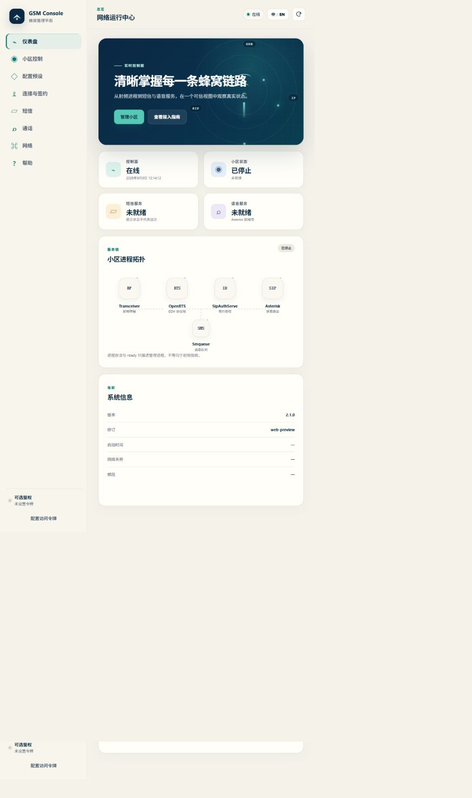
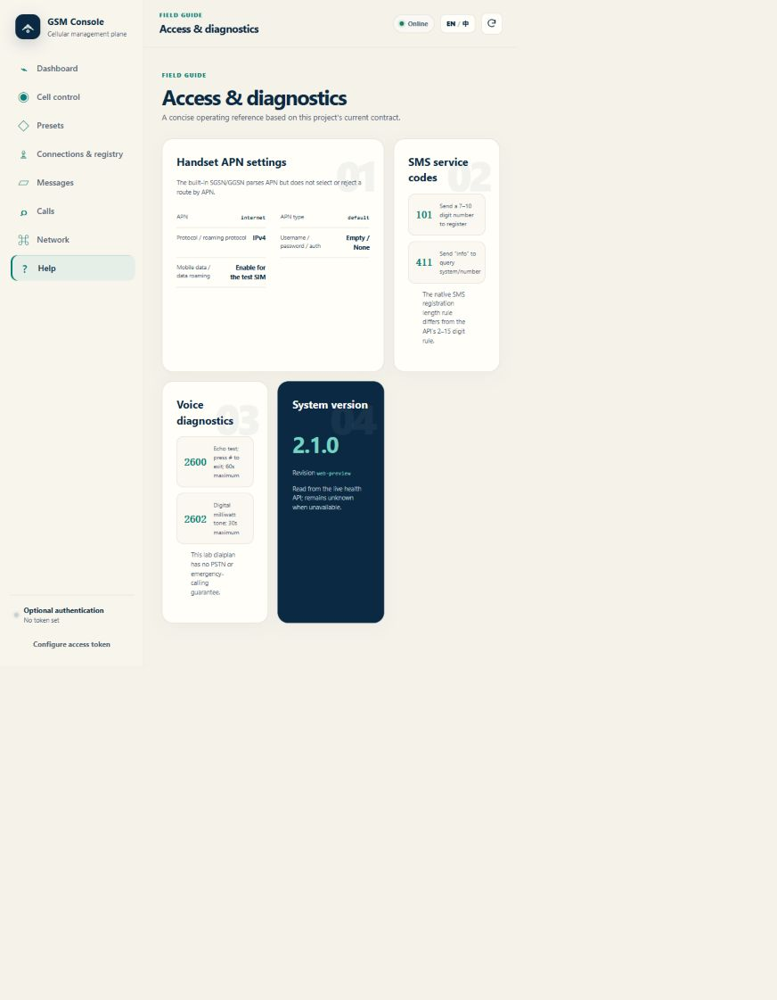

# Web console / Web 管理台

## Interface tour / 界面导览

The screenshots below use a disposable preview with no subscriber data or RF
device. They illustrate the interface, not an operational radio acceptance.
以下截图来自无签约数据、无射频设备的隔离预览，仅展示界面，不代表无线业务验收。





## One image, two entry points / 一个镜像、两个入口

The static console is embedded in the Go binary. No external font/CDN, JavaScript
package download or Node process is needed in the runtime container. The Web
listener serves static files and forwards same-origin `/api/v1` requests to the
same authenticated Go handler used by the independent API listener.
前端静态资源内嵌 Go 程序，无外部字体/CDN、运行时依赖下载或 Node 进程；Web 监听器
提供页面，并将同源 `/api/v1` 交给与独立 API 监听器相同的 Go 处理器和鉴权逻辑。

```text
Browser / 浏览器 → HOST:8080 → Go Web + embedded assets / 内嵌资源
                                  └ /api/v1 → existing Go API / 原有 API
Postman / integration → HOST:8082 ────────────┘  optional / 可选
Native GSM / SIP / RTP / CLI remain inside the container / 原生端口保留在容器内部
```

| Startup setting / 启动配置 | Default / 默认 | Meaning / 含义 |
|---|---|---|
| `GSM_WEB_PORT` | `8080` | Published Web host port / Web 宿主机端口 |
| `GSM_API_PORT` | `8082` | Published API host port, only when enabled / 启用时的 API 宿主机端口 |
| `GSM_EXPOSE_API` | `false` | Deployment-script API overlay selection / 部署脚本选择 API overlay |
| `GSM_BIND_ADDRESS` | `0.0.0.0` | Use the actual LAN address to limit exposure / 建议填实际 LAN 地址 |
| `GSM_API_TOKEN` | empty / 空 | Same optional token at both entry points / 两入口共用可选令牌 |
| `GSM_WEB_PUBLIC_ORIGIN` | empty / 空 | Exact external origin behind a trusted TLS proxy / 可信 TLS 代理后的精确外部 origin |
| `TZ` | `Asia/Shanghai` | Runtime timezone / 运行时区 |

Default Compose publishes **only 8080** and binds the separate API to container
loopback. Web must still expose `/api/v1` for interactive operations: this is
port isolation, not an authentication boundary. A blank token gives every client
able to reach Web full API access; use a trusted LAN or configure a token and TLS
termination when appropriate. Do not expose this privileged radio-management
container directly to the Internet.
默认仅发布 8080，独立 API 绑定容器回环；Web 交互仍需公开同源 `/api/v1`，因此隐藏
独立端口不是权限隔离。令牌留空时能访问 Web 的客户端也能操作 API；应限制在可信局域网，
按需启用令牌与 TLS 入口，不将具有射频管理权限的容器直接暴露到互联网。

## Deploy / 部署

Use the normal gated deployment script. It reads Compose-resolved `.env` values
without executing that file. Enabling a different host port requires recreating
the container; radio startup is always explicit and restart policy remains `no`.
使用带验收门禁的正常部署脚本，它读取 Compose 解析后的 `.env` 而不执行文件。
宿主机端口更改需要重建容器；射频仍须显式启动，容器自启仍关闭。

For TLS termination, explicitly set e.g. `GSM_WEB_PUBLIC_ORIGIN=https://gsm.example.invalid`.
The Web handler checks this exact origin instead of trusting arbitrary forwarded
headers. Leave it blank for direct LAN access; include no path/query/credentials.
TLS 终止场景须显式填精确 HTTPS origin，Web 按该值验证而不信任任意转发头；
直连局域网留空，值中不含路径、查询或凭据。

```dotenv
# Default Web-only / 默认仅 Web
GSM_WEB_PORT=8080
GSM_EXPOSE_API=false
GSM_API_PORT=8082

# Test installation: change only this flag to expose both / 测试机两端口改为：
# GSM_EXPOSE_API=true
```

```sh
./scripts/deploy_to_ubuntu.sh --skip-build
```

`GSM_EXPOSE_API` is a deployment-script option, not built-in Compose syntax.
For inspection with direct Compose, explicitly select the same overlay:
此开关由部署脚本处理，不是 Compose 原生条件语法；直接检查 Compose 时需选相同 overlay：

```sh
# Web only / 仅 Web
docker compose --env-file .env -f deploy/docker/docker-compose.yml config --services
# Both ports / 两端口
docker compose --env-file .env -f deploy/docker/docker-compose.yml \
  -f deploy/docker/docker-compose.api.yml config --services
```

Do not publish SIP, RTP, TRX, CLI, SQLite or the syslog socket. Changing published
ports does not change the bridge uplink (`eth0`) or GPRS handset pool.
不要发布原生 SIP/RTP/TRX/CLI、SQLite 或 syslog；端口变化不改变容器 eth0 或手机地址池。

## Operator workflow / 操作流程

1. Select Chinese/English; configure a token if the server requires one. Tokens
   are never bundled into assets or inferred from server configuration.
   选择中英文；服务端要求令牌时填写，页面资源不包含或自动获取服务端令牌。
2. Read the dashboard's live process state. Unknown, failed and stopped are
   distinct from healthy; HTTP availability does not prove handset Internet.
   查看真实进程状态；未知、失败、停止与健康分别展示，HTTP 可达不代表手机能上网。
3. Choose a preset, enter a complete custom profile, or reuse the saved profile.
   Review and explicitly confirm start/stop operations. Browsing does not start RF.
   选择预设、完整自定义或上次配置，确认后显式启停；打开页面不会启动射频。
4. Manage number bindings, send SMS, browse current-launch SMS and call records.
   Submitted SMS is not a delivery receipt; empty or unavailable fields remain
   distinguishable rather than being replaced by made-up content.
   管理号码绑定、发送短信并查看本次短信及话单；提交成功不等于送达，不伪造空字段内容。
5. Inspect network forwarding/NAT and use guided GPRS troubleshooting. Native
   radio/phone confirmation is still needed for voice and packet-data acceptance.
   查看转发/NAT 与 GPRS 排障提示，通话及数据业务仍须真机验证。

The interface supports keyboard focus, responsive layouts, reduced-motion
preferences, visible pending/error states and request IDs. History is paginated;
visible-page polling runs every 12 seconds after the prior refresh completes and
must not silently trigger mutation or radio operations.
界面支持键盘焦点、响应式布局、减少动画偏好、待处理/错误状态和请求 ID，历史分页；
可见页在上轮刷新完成后间隔 12 秒轮询，不执行写操作或射频动作。

## Troubleshooting / 排错

- `401`: check the token in this browser session; both ports use the same token.
  401 检查浏览器会话令牌，两入口规则相同。
- Web works but Postman 8082 fails: check `GSM_EXPOSE_API` and recreate with the
  deploy script. Postman can also use Web-origin `http://HOST:8080/api/v1`.
  Web 正常但 8082 不通时检查显式暴露开关；Postman 也可使用 Web 同源入口。
- `degraded` is a backend observation, not a UI loading error. Inspect logs and
  process readiness before repeating start requests.
  degraded 是后端观测状态，不是页面加载错误；先查日志和进程再重试启动。
- API port isolation does not disable API access from the Web port. Authenticate
  and restrict network access according to the deployment threat model.
  隐藏独立 API 端口不会关闭 Web 端口的 API，仍需按部署环境配置鉴权和访问范围。

See [API](API.md), [deployment](DEPLOY.md), [GPRS](GPRS-RECOVERY.md),
[release process](RELEASING.md) and [acceptance record](RELEASE-2.1.md).
